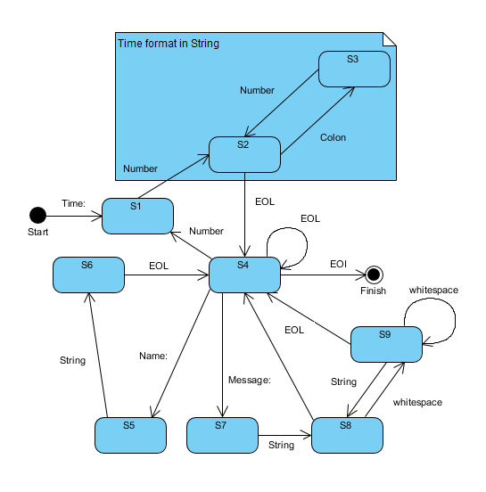
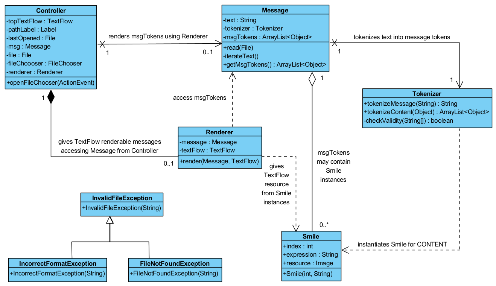
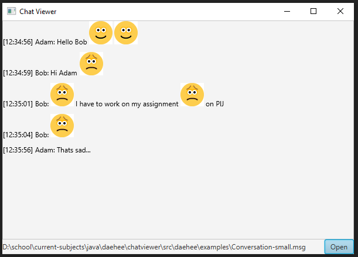
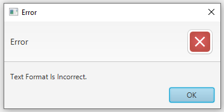

# chatviewer

This project was created and developed for Java Programming class of 2020 at Prague College.

## Goal

The application allows users to load message files saved in a particular format.

## Format

The application accepts .msg files.

The .msg syntax consists of:
 - TIMESTAMP (hh:mm:ss)
 - NICKNAME (username)
 - CONTENT (message line)
 - EOL (End of Line)
 - EOI (End of Input)
 
TIMESTAMP, NICKNAME, CONTENT and EOL make a single **_message stub_**.

Several message stubs (or one stub if the shortest) end with EOI, which marks the end of file reading.

CONTENT may contain a combination of special characters e.g. **:)** or **:(** that represents an emoticon.

## Finite State Machine (FSM)

The diagram illustrates every possible action and state of the application in the process of a .msg file.

## UML for Entity-Relationship (ER)

The diagram illustrates the relationships between each and every class developed for the application.

## Validation Test

The screenshot shows a functioning application.

The test was carried out with 5 different .msg files (can be found [here](src/daehee/examples)).

The syntax of an .msg must consist of:
 - a message or messages composed of three lines and an empty line,
 - exact prefixes i.e. “Time:”, “Name:” and “Message:”,
 - “hh:mm:ss” (hour:minute:second) for the timestamp suffix.
 
 
 
 Otherwise, the application shows the above error.

The application behaves correctly when it:
 - initializes with a textflow panel, a path label and a button;
 - opens a file chooser dialog;
 - accepts an .msg file;
 - displays the path to the file;
 - displays the texts from the file;
 - converts Smiley texts into images;
 - opens an error pop-up when an exception is encountered.
 
A client-side exception is encountered when:
 - the file path is not correct or does not exist;
 - the syntax of the file is incorrect.
